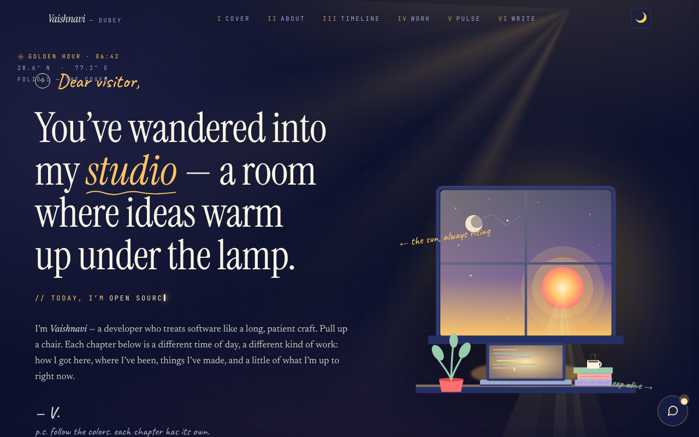

# Vaishnavi Dubey — Portfolio

A modern personal portfolio built with **Next.js 14 (App Router)**, **TypeScript**, and **Tailwind CSS**.

## ✨ Features

- Animated **hero** with typewriter effect
- **GitHub API** integration — public repos auto-fetched and displayed
- **ISR** (`revalidate: 60`) — content refreshes every 60 seconds
- **Dark / light mode** toggle (system-aware) via `next-themes`
- **Smooth scroll** navigation between sections
- Fully responsive, accessible, Vercel-ready

## 🚀 Getting started

```bash
npm install
npm run dev
```

## 📸 Screenshots

### Portfolio Home View


---

## 🔑 Optional environment variables

Create a `.env.local` to raise the GitHub API rate limit (60 → 5000/hr):

```
GITHUB_TOKEN=ghp_your_personal_access_token_here
```

Only the `public_repo` scope is needed.

## 🛠 Scripts

| Command         | Description              |
| --------------- | ------------------------ |
| `npm run dev`   | Start dev server         |
| `npm run build` | Production build         |
| `npm run start` | Run production build     |
| `npm run lint`  | Lint with ESLint         |

## ☁️ Deploy to Vercel

1. Push this repo to GitHub.
2. Import it in [Vercel](https://vercel.com/new).
3. (Optional) Add `GITHUB_TOKEN` env var.
4. Deploy — that's it.

## 📁 Structure

```
app/         # App Router pages & layout
components/  # UI components (Hero, Projects, Navbar, ...)
lib/         # GitHub API helper
public/      # Static assets
```
